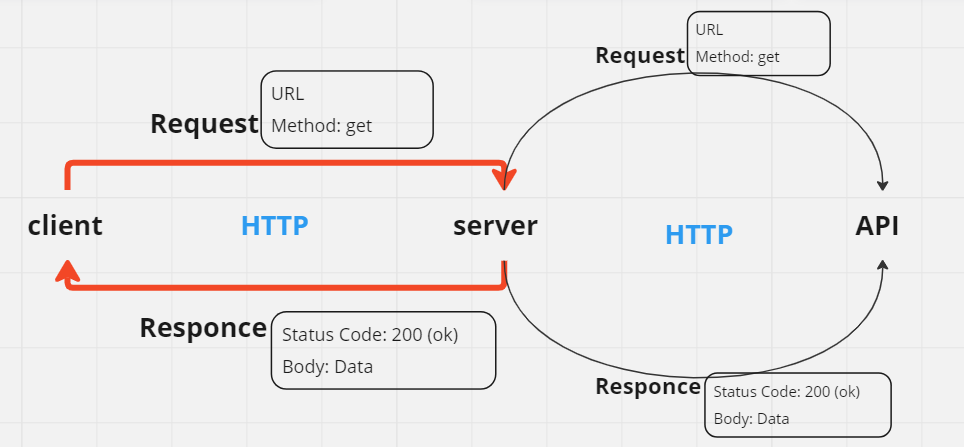
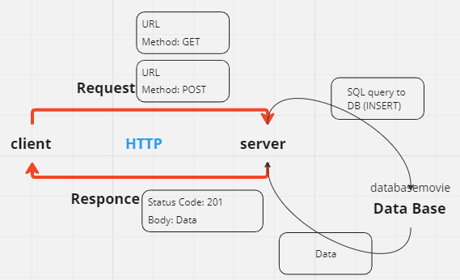
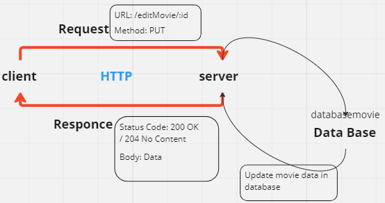
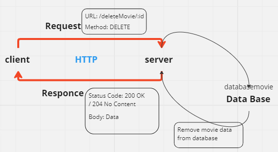

# Movies-Library -  Version-1

**Author Name**: NOOR ALBONNE

## WRRC







## Overview
This project is a movie app that lets users browse the latest films by category.

## Getting Started
Set up your server repository:

1. **Create a repository on GitHub**: Create a repository called Movies-Library on GitHub to host your project.

2. **Initialize your project**: Run the following command in your project directory to initialize your project with npm:
    ```bash
    npm init -y
    ```

3. **Create a new branch**: Create a new branch called Lab11 to work on your project:
    ```bash
    git checkout -b Lab11
    ```

4. **Create basic file structure**:
   - Create a server file (e.g., `server.js`) to define your Express.js server.
   - Create a `.gitignore` file to specify files and directories to ignore in Git.
   - Create an `.eslintrc.json` file to configure ESLint for linting your JavaScript code.

Project Setup with Express.js:

1. **Download Node.js**: Ensure you have Node.js installed. You can download it from [Node.js website](https://nodejs.org/).

2. **Download Express.js**:
   - Install Express.js: Run the following command to install Express.js:
     ```bash
     npm install express
     ```
   - Set up your server:
     ```javascript
     const express = require("express");
     const app = express();
     app.get("/", (req, res) => {
         // Your route handling code here
     });
     app.listen(8080, () => {
         console.log("Listening to port 8080");
     });
     ```

3. **Run the Server**:
   - Start your server using Node.js: `node server.js`.
   - Alternatively, use Nodemon for automatic server restarts during development: `npm install nodemon`.

<!-- LAB12 -->

 -- **3rd party API**
 1. search for API 
 2. Read Documination
 3. Request --> API

 -- **33 WAYS TO REQUEST SERVER**
 1. fetch 
 2. axios = which we use
 3. superAgent


<!-- LAB13 -->
  -- **DataBase**
 1. creat DB
 2. creat a table
 3. connect server to DB
 4. READ +SEND from DB

 <!-- LAB14 -->
 -- **CRUD**
 1. Create update and delete requests
 2. Update (UPDATE) a record in the database
 3. Delete (Delete) a record from the database
 4. Read (SELECT) a record from the database

## Project Features

- **Browse Movies by Category**: Users can view a list of movies sorted by different genres.
- **Search Functionality**: Users can search for specific movies by title, actor, or keyword.
- **Movie Details**: Users can view detailed information about each movie, such as its synopsis, release date, and cast.
- **User Ratings and Reviews**: Users can rate and review movies, and view ratings and reviews from other users.
- **Watch Trailers**: Users can watch trailers for selected movies.
- **Personalized Recommendations**: Users receive movie recommendations based on their viewing history or preferences.
- **User Authentication**: Users can create accounts, log in, and save favorite movies or personalized preferences.
