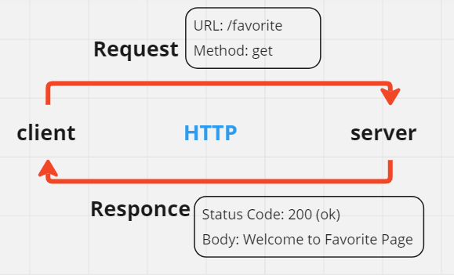
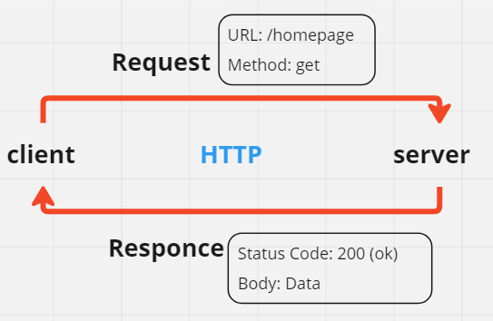

# Movies-Library -  Version-1

**Author Name**: NOOR ALBONNE

## WRRC

## Overview
This project is a movie app that lets users browse the latest films by category.

## Getting Started
- draw WRRC to figure out your project
- you should download node- LTC
- you should download Express: 
1.npm init -y -y : yes
2.create index.js file , name is optional
3.npm install express to install express package to use it
4.run the server using node index.js
5.install nodemon npm install nodemon

your code should contain these lines as basic :
-const express = require("express");
const app = express();
app.get("/", (req, res) => {
    // Your route handling code here
});
app.listen(8080, () => {
    console.log("Listening to port 8080");
});

## Project Features

- **Browse Movies by Category**: Users can view a list of movies sorted by different genres.
- **Search Functionality**: Users can search for specific movies by title, actor, or keyword.
- **Movie Details**: Users can view detailed information about each movie, such as its synopsis, release date, and cast.
- **User Ratings and Reviews**: Users can rate and review movies, and view ratings and reviews from other users.
- **Watch Trailers**: Users can watch trailers for selected movies.
- **Personalized Recommendations**: Users receive movie recommendations based on their viewing history or preferences.
- **User Authentication**: Users can create accounts, log in, and save favorite movies or personalized preferences.
